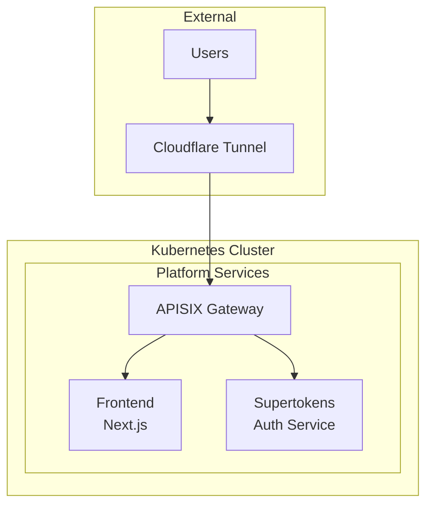

# 🏗️ Puchi - Modern Language Learning Platform

> **Self-hosted, minimal infrastructure with Kubernetes + APISIX + SuperTokens**

[](LICENSE)
[](docs/)

## 📋 Table of Contents

- [🎯 Overview](#-overview)
- [🏛️ Architecture](#️-architecture)
- [🚀 Quick Start](#-quick-start)
- [📁 Project Structure](#-project-structure)
- [📚 Documentation](#-documentation)
- [🤝 Contributing](#-contributing)

## 🎯 Overview

Puchi is a modern language learning platform. This repo is optimized for a single self-hosted environment. Infrastructure is deployed directly on the host using the `infra/host-self/` bundle (no Argo CD / GitOps required). Secrets and rendered manifests are not committed.

## 🏛️ Architecture

### High-Level Architecture



### Core Components

- **Frontend**: `apps/frontend`
- **Authentication**: SuperTokens (namespace `auth`)
- **API Gateway**: APISIX (namespace `apisix`)
- **Tunnel/Edge**: Cloudflared (namespace `platform`)

## 🚀 Quick Start

Deploy infra on your host using the self-host bundle:

```bash
cd infra/host-self
chmod +x scripts/*.sh

# 1) Install k0s + kubeconfig + helm
./scripts/bootstrap-k0s.sh

# 2) Base namespaces/policies
kubectl apply -k manifests/base

# 3) Cloudflared
export TUNNEL_TOKEN=YOUR_TUNNEL_TOKEN
./scripts/deploy-cloudflared.sh

# 4) APISIX
./scripts/deploy-apisix.sh

# 5) SuperTokens
export ST_DB_URI="postgresql://USER:PASSWORD@DB_HOST:5432/supertokens"
export CHART_PATH="/path/to/supertokens/helm-chart"
./scripts/deploy-supertokens.sh

# 6) Ingress for SuperTokens
kubectl apply -k manifests/supertokens
```

## 📁 Project Structure

```
puchi-app/
├── apps/
│   ├── frontend/
│   └── services/
├── infra/
│   └── host-self/
│       ├── README.md
│       ├── scripts/
│       └── manifests/
├── docs/
└── README.md
```

## 📚 Documentation

- `infra/host-self/README.md` — Self-host bundle guide
- `docs/operations/deployment-guide.md` — Deployment steps (self-host)
- `docs/operations/troubleshooting.md` — Troubleshooting (see note at top)

## 🤝 Contributing

We welcome contributions! Please see [CONTRIBUTING.md](CONTRIBUTING.md).
