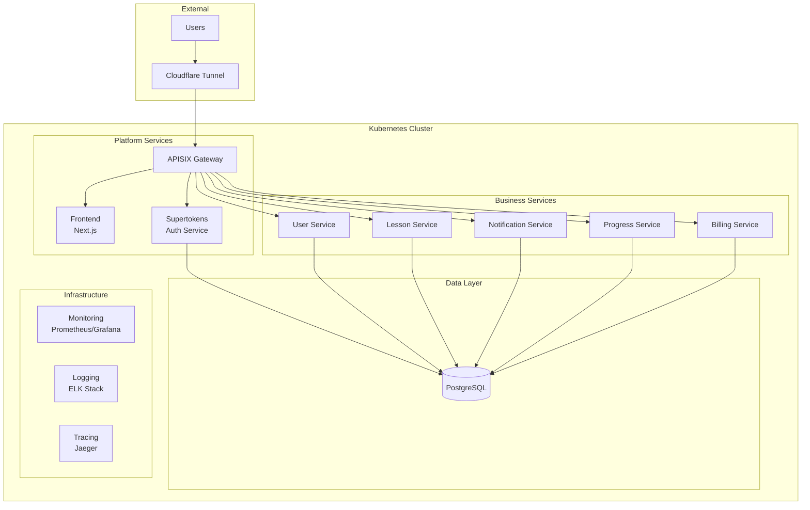
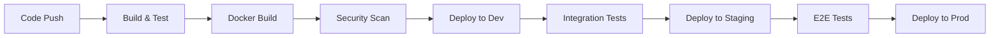

# 🏗️ Puchi - Modern Language Learning Platform

> **A comprehensive microservices-based language learning platform built with modern cloud-native technologies**

[](https://github.com/hoan02/puchi-app/actions)
[](LICENSE)
[](docs/)

## 📋 Table of Contents

- [🎯 Overview](#-overview)
- [🏛️ Architecture](#️-architecture)
- [🚀 Quick Start](#-quick-start)
- [📁 Project Structure](#-project-structure)
- [🔧 Development](#-development)
- [🚢 Deployment](#-deployment)
- [📚 Documentation](#-documentation)
- [🤝 Contributing](#-contributing)

## 🎯 Overview

Puchi is a modern, scalable language learning platform that leverages microservices architecture to provide:

- **Personalized Learning Experience**: AI-driven content adaptation
- **Multi-language Support**: 9+ languages with i18n
- **Real-time Features**: Live lessons, chat, and progress tracking
- **Gamification**: Points, levels, achievements, and social features
- **Cross-platform**: Web, mobile-responsive design

### 🌐 Live Environments

| Environment | URL                                                | Status     |
| ----------- | -------------------------------------------------- | ---------- |
| Development | [dev.puchi.io.vn](https://dev.puchi.io.vn)         | 🟢 Active  |
| Staging     | [staging.puchi.io.vn](https://staging.puchi.io.vn) | 🟡 Testing |
| Production  | [puchi.io.vn](https://puchi.io.vn)                 | 🟢 Active  |

## 🏛️ Architecture

### High-Level Architecture



### Core Components

#### 🎨 Frontend (`apps/frontend`)

- **Technology**: Next.js 14, TypeScript, TailwindCSS
- **Features**: SSR/SSG, i18n, PWA, Real-time updates
- **Namespace**: `puchi-fe`
- **Domain**: `dev.puchi.io.vn`

#### 🔐 Authentication (`infra/k8s/platform/supertokens`)

- **Technology**: Supertokens (self-hosted)
- **Features**: JWT, OAuth, Email verification, Session management
- **Namespace**: `auth`
- **Domain**: `auth.puchi.io.vn`

#### 🛡️ API Gateway (`infra/k8s/platform/apisix`)

- **Technology**: Apache APISIX
- **Features**: Load balancing, Rate limiting, Authentication, Monitoring
- **Domain**: `gateway.puchi.io.vn`

#### 🏢 Microservices (`apps/services/`)

| Service                | Technology    | Purpose                   | Namespace      |
| ---------------------- | ------------- | ------------------------- | -------------- |
| `user-service`         | Go, gRPC/HTTP | User management, profiles | `user`         |
| `lesson-service`       | Go, gRPC/HTTP | Content delivery, lessons | `lesson`       |
| `notification-service` | Go, gRPC/HTTP | Real-time notifications   | `notification` |
| `progress-service`     | Go, gRPC/HTTP | Learning analytics        | `progress`     |
| `billing-service`      | Go, gRPC/HTTP | Payment, subscriptions    | `billing`      |

#### 🗄️ Data Layer

- **Primary Database**: PostgreSQL (Bitnami Helm Chart)
- **Namespace**: `database`
- **Features**: Connection pooling, Backup, Monitoring

## 🚀 Quick Start

### Prerequisites

- [Docker](https://docs.docker.com/get-docker/) 20.10+
- [Kubernetes](https://kubernetes.io/docs/tasks/tools/) 1.25+
- [Helm](https://helm.sh/docs/intro/install/) 3.10+
- [Tilt](https://docs.tilt.dev/install.html)

### Local Development

1. **Clone and initialize submodules**:

   ```bash
   git clone https://github.com/hoan02/puchi-app.git
   cd puchi-app
   make init
   ```

2. **Start development environment**:

   ```bash
   # Using Tilt
   tilt up
   ```

3. **Access applications**:
   - Frontend: http://localhost:3000
   - API Gateway: http://localhost:9080
   - Auth Service: http://localhost:3567

### Production Deployment

1. **Deploy to development environment**:

   ```bash
   make deploy-dev
   ```

2. **Deploy to production**:
   ```bash
   make deploy-prod
   ```

## 📁 Project Structure

```
puchi-app/
├── 📁 apps/                          # Application code
│   ├── 📁 frontend/                  # Next.js frontend
│   │   ├── 📁 src/                   # Source code
│   │   ├── 📁 public/                # Static assets
│   │   ├── 📁 k8s/                   # Kubernetes manifests
│   │   └── 📄 package.json           # Dependencies
│   └── 📁 services/                  # Microservices
│       ├── 📁 user-service/          # User management service
│       ├── 📁 lesson-service/        # Lesson content service
│       ├── 📁 notification-service/  # Notification service
│       ├── 📁 progress-service/      # Progress tracking service
│       └── 📁 billing-service/       # Payment service
├── 📁 infra/                         # Infrastructure as Code
│   ├── 📁 k8s/                       # Kubernetes configurations
│   │   ├── 📁 base/                  # Base configurations
│   │   ├── 📁 overlays/              # Environment-specific configs
│   │   ├── 📁 platform/              # Platform services (APISIX, Supertokens)
│   │   └── 📁 services/              # Application services
│   ├── 📁 charts/                    # Helm charts
│   ├── 📁 cloudflare/                # Cloudflare configurations
│   └── 📁 supertokens/               # Auth configurations
├── 📁 docs/                          # Documentation
│   ├── 📁 architecture/              # Architecture documentation
│   ├── 📁 adr/                       # Architecture Decision Records
│   └── 📁 runbooks/                  # Operational runbooks
├── 📁 scripts/                       # Automation scripts
│   ├── 📁 ci/                        # CI/CD scripts
│   ├── 📁 dev/                       # Development scripts
│   └── 📁 bootstrap/                 # Setup scripts
├── 📁 ci/                            # CI/CD pipelines
│   ├── 📁 pipelines/                 # Pipeline definitions
│   └── 📁 .github/                   # GitHub Actions
├── 📄 Makefile                       # Build automation
├── 📄 Tiltfile                       # Tilt configuration
└── 📄 README.md                      # This file
```

## 🔧 Development

### Development Workflow

1. **Feature Development**:

   ```bash
   # Create feature branch
   git checkout -b feature/new-feature

   # Start development environment
   make dev-start

   # Run tests
   make test

   # Build and test
   make build
   ```

2. **Code Quality**:

   ```bash
   # Lint code
   make lint

   # Format code
   make format

   # Security scan
   make security-scan
   ```

3. **Testing**:

   ```bash
   # Unit tests
   make test-unit

   # Integration tests
   make test-integration

   # E2E tests
   make test-e2e
   ```

### Environment Configuration

| Environment | Kubernetes Context | Namespace       | Domain                |
| ----------- | ------------------ | --------------- | --------------------- |
| Local       | `docker-desktop`   | `puchi-local`   | `localhost`           |
| Development | `microk8s`         | `puchi-dev`     | `dev.puchi.io.vn`     |
| Staging     | `staging-cluster`  | `puchi-staging` | `staging.puchi.io.vn` |
| Production  | `prod-cluster`     | `puchi-prod`    | `puchi.io.vn`         |

## 🚢 Deployment

### CI/CD Pipeline



### Deployment Commands

```bash
# Development deployment
make deploy-dev

# Production deployment
make deploy-prod

# Rollback
make rollback ENV=prod VERSION=v1.2.3
```

### Monitoring & Observability

- **Metrics**: Prometheus + Grafana
- **Logs**: ELK Stack (Elasticsearch, Logstash, Kibana)
- **Tracing**: Jaeger
- **Health Checks**: Kubernetes liveness/readiness probes
- **Alerting**: AlertManager + PagerDuty

## 📚 Documentation

### Architecture Documentation

- [System Architecture](docs/architecture/system-architecture.md)
- [API Design](docs/architecture/api-design.md)
- [Database Schema](docs/architecture/database-schema.md)
- [Security Model](docs/architecture/security-model.md)

### Development Guides

- [Getting Started](docs/development/getting-started.md)
- [API Documentation](docs/development/api-documentation.md)
- [Testing Strategy](docs/development/testing-strategy.md)
- [Code Style Guide](docs/development/code-style-guide.md)

### Operations

- [Deployment Guide](docs/operations/deployment-guide.md)
- [Monitoring Guide](docs/operations/monitoring-guide.md)
- [Troubleshooting](docs/operations/troubleshooting.md)
- [Disaster Recovery](docs/operations/disaster-recovery.md)

### Architecture Decision Records (ADRs)

- [ADR-001: Microservices Architecture](docs/adr/001-microservices-architecture.md)
- [ADR-002: Authentication Strategy](docs/adr/002-authentication-strategy.md)
- [ADR-003: API Gateway Selection](docs/adr/003-api-gateway-selection.md)

## 🤝 Contributing

We welcome contributions! Please see our [Contributing Guide](CONTRIBUTING.md) for details.

### Development Setup

1. Fork the repository
2. Create a feature branch
3. Make your changes
4. Add tests
5. Submit a pull request

### Code Standards

- Follow [Conventional Commits](https://conventionalcommits.org/)
- Maintain test coverage > 80%
- Update documentation for API changes
- Follow security best practices

---

## 📞 Support

- **Documentation**: [docs/](docs/)
- **Issues**: [GitHub Issues](https://github.com/hoan02/puchi-app/issues)
- **Discussions**: [GitHub Discussions](https://github.com/hoan02/puchi-app/discussions)
- **Email**: support@puchi.io.vn

## 📄 License

This project is licensed under the MIT License - see the [LICENSE](LICENSE) file for details.

---

**Built with ❤️ by the Puchi Team**
