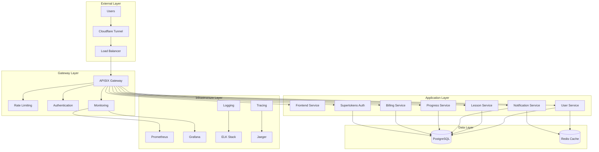

# System Architecture

## Overview

Puchi is built using a modern microservices architecture that provides scalability, maintainability, and developer productivity. The system is designed to handle language learning workloads with real-time features, gamification, and multi-language support.

## Architecture Principles

### 1. Microservices Architecture

- **Domain-Driven Design**: Each service owns a specific business domain
- **Independent Deployability**: Services can be deployed independently
- **Technology Diversity**: Each service can use the most appropriate technology stack
- **Fault Isolation**: Failure in one service doesn't cascade to others

### 2. Cloud-Native Design

- **Container-First**: All services are containerized using Docker
- **Kubernetes-Native**: Designed to run on Kubernetes
- **12-Factor App**: Follows the 12-factor methodology
- **Stateless Services**: Services are designed to be stateless and horizontally scalable

### 3. API-First Design

- **RESTful APIs**: Standard HTTP/REST for external APIs
- **gRPC**: High-performance internal service communication
- **GraphQL**: Flexible data fetching for frontend
- **OpenAPI**: Comprehensive API documentation

## High-Level Architecture

## Service Architecture

### Frontend Service

- **Technology**: Next.js 14, TypeScript, TailwindCSS
- **Pattern**: Server-Side Rendering (SSR) with Static Site Generation (SSG)
- **Features**:
  - Internationalization (i18n)
  - Progressive Web App (PWA)
  - Real-time updates via WebSocket
  - Responsive design

### User Service

- **Technology**: Go, gRPC, HTTP REST
- **Domain**: User management, profiles, preferences
- **Features**:
  - User registration and authentication
  - Profile management
  - User preferences and settings
  - Social features (friends, followers)

### Lesson Service

- **Technology**: Go, gRPC, HTTP REST
- **Domain**: Content delivery, lesson management
- **Features**:
  - Lesson content management
  - Adaptive learning algorithms
  - Content personalization
  - Progress tracking integration

### Notification Service

- **Technology**: Go, gRPC, WebSocket
- **Domain**: Real-time notifications, messaging
- **Features**:
  - Push notifications
  - Real-time messaging
  - Email notifications
  - SMS notifications

### Progress Service

- **Technology**: Go, gRPC, HTTP REST
- **Domain**: Learning analytics, progress tracking
- **Features**:
  - Learning progress tracking
  - Analytics and reporting
  - Achievement system
  - Performance metrics

### Billing Service

- **Technology**: Go, gRPC, HTTP REST
- **Domain**: Payment processing, subscriptions
- **Features**:
  - Payment processing
  - Subscription management
  - Billing analytics
  - Invoice generation

## Data Architecture

### Database Design

- **Primary Database**: PostgreSQL
- **Caching Layer**: Redis
- **Search Engine**: Elasticsearch (for content search)
- **File Storage**: MinIO (S3-compatible)

### Data Patterns

- **Database per Service**: Each service owns its data
- **Event Sourcing**: For audit trails and analytics
- **CQRS**: Separate read and write models where needed
- **Saga Pattern**: For distributed transactions

## Security Architecture

### Authentication & Authorization

- **Identity Provider**: Supertokens (self-hosted)
- **Protocols**: JWT, OAuth 2.0, OpenID Connect
- **Features**: Multi-factor authentication, social login

### Network Security

- **API Gateway**: APISIX with rate limiting and authentication
- **Service Mesh**: Istio for service-to-service communication
- **TLS**: End-to-end encryption
- **Network Policies**: Kubernetes network segmentation

### Data Security

- **Encryption at Rest**: Database encryption
- **Encryption in Transit**: TLS everywhere
- **Secrets Management**: Kubernetes secrets with external vault
- **Data Privacy**: GDPR compliance

## Deployment Architecture

### Environment Strategy

- **Local Development**: Docker Compose
- **Development**: Kubernetes cluster with CI/CD
- **Production**: High-availability Kubernetes cluster

### CI/CD Pipeline

- **Source Control**: Git with GitHub
- **Build**: Docker containerization
- **Testing**: Unit, integration, and E2E tests
- **Security**: Vulnerability scanning
- **Deployment**: Blue-green deployments
- **Monitoring**: Comprehensive observability

## Scalability & Performance

### Horizontal Scaling

- **Auto-scaling**: Kubernetes HPA based on metrics
- **Load Balancing**: APISIX gateway with health checks
- **Caching**: Multi-level caching strategy
- **CDN**: Cloudflare for static assets

### Performance Optimization

- **Database Optimization**: Query optimization, indexing
- **Caching Strategy**: Redis for frequently accessed data
- **Content Delivery**: CDN for static assets
- **Code Optimization**: Profiling and optimization

## Monitoring & Observability

### Metrics

- **Application Metrics**: Prometheus + Grafana
- **Infrastructure Metrics**: Node Exporter, cAdvisor
- **Business Metrics**: Custom dashboards

### Logging

- **Centralized Logging**: ELK Stack
- **Structured Logging**: JSON format with correlation IDs
- **Log Aggregation**: Fluentd for log collection

### Tracing

- **Distributed Tracing**: Jaeger
- **Service Mesh**: Istio for automatic tracing
- **Performance Analysis**: Trace analysis and optimization

## Disaster Recovery

### Backup Strategy

- **Database Backups**: Automated daily backups
- **Configuration Backups**: Infrastructure as Code
- **Application Backups**: Container image registry

### Recovery Procedures

- **RTO**: Recovery Time Objective < 1 hour
- **RPO**: Recovery Point Objective < 15 minutes
- **Failover**: Automated failover procedures
- **Testing**: Regular disaster recovery drills

## Future Considerations

### Planned Enhancements

- **Machine Learning**: AI-driven personalization
- **Mobile Apps**: Native iOS and Android applications
- **Offline Support**: Progressive Web App capabilities
- **Advanced Analytics**: Real-time learning analytics

### Technology Evolution

- **Service Mesh**: Full Istio adoption
- **Serverless**: Function-as-a-Service integration
- **Edge Computing**: Edge deployment for low latency
- **Blockchain**: Decentralized identity and achievements
